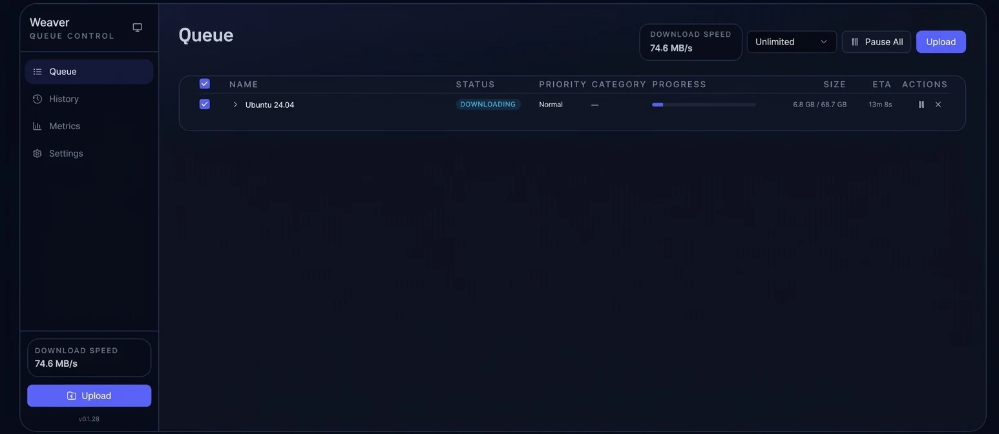

<p align="center">
  
</p>

<h1 align="center">Weaver</h1>

<p align="center">
  A modern, all-in-one Usenet downloader built in Rust.<br/>
  Download, repair, and extract — in a single binary.
</p>

<p align="center">
  <a href="https://github.com/scryer-media/weaver/releases"></a>
  <a href="https://github.com/scryer-media/weaver/blob/main/LICENSE"></a>
  <a href="https://ghcr.io/scryer-media/weaver"></a>
</p>

---

<p align="center">
  
</p>

## What is Weaver?

Weaver is a Usenet binary downloader that handles the entire pipeline — downloading articles, decoding, PAR2 verification and repair, and RAR extraction — all within a single self-contained binary. No need to install `unrar`, `par2repair`, or any other external tools.

Instead of the traditional sequential approach (download everything, then repair, then extract), Weaver runs all stages concurrently. Extraction begins as soon as the first archive volume finishes downloading, so files appear on disk while the rest of the job is still in progress.

### Key Features

- **Single binary** — no external `unrar`, `par2`, or other tools required
- **Faster** — 15-18% faster side by side with NZBGet downloading large files, due to running all operations in one process and not shelling out to external tools
- **Incremental extraction** — starts extracting files while still downloading
- **Real-time updates** — WebSocket push for job progress and system events
- **Monthly quotas** — daily, weekly, or monthly data limits with configurable billing windows
- **Prometheus metrics** — native `/metrics` endpoint for observability

## Install

### Docker

Create a `docker-compose.yml`:

```yaml
services:
  weaver:
    image: ghcr.io/scryer-media/weaver:latest
    ports:
      - "9090:9090"
    volumes:
      - weaver-config:/config
      - /path/to/downloads:/downloads

volumes:
  weaver-config:
```

```bash
docker compose up -d
```

Open **http://localhost:9090** and you're ready to go.

Weaver stores its configuration and database in `/config` inside the container. Mount a volume or host directory there to persist settings across restarts.

#### Reverse Proxy (Subpath)

To host Weaver at a subpath like `https://example.com/weaver/`:

```yaml
services:
  weaver:
    image: ghcr.io/scryer-media/weaver:latest
    command: ["--config", "/config", "serve", "--port", "9090", "--base-url", "/weaver"]
    ports:
      - "9090:9090"
    volumes:
      - weaver-config:/config
      - /path/to/downloads:/downloads

volumes:
  weaver-config:
```

Then configure your reverse proxy (nginx, Traefik, Caddy, etc.) to forward `/weaver/` to Weaver's port.

#### Environment Variables

| Variable | Description |
|----------|-------------|
| `RUST_LOG` | Logging level (`error`, `warn`, `info`, `debug`, `trace`). Default: `info` |

### Homebrew (macOS / Linux)

```bash
brew tap scryer-media/weaver
brew install weaver-usenet
```

To run as a background service (auto-starts on login, restarts on crash):

```bash
brew services start weaver-usenet
brew services stop weaver-usenet
brew services restart weaver-usenet
```

### Binary

Download the latest release from the [releases page](https://github.com/scryer-media/weaver/releases). Available for Linux (x86_64, arm64) and macOS (Apple Silicon, Intel).

## Comparison

| | Weaver | NZBGet | SABnzbd |
|---|---|---|---|
| Language | Rust | C++ | Python |
| Runtime | Native binary | Native binary | Python interpreter + dependencies |
| Idle memory | ~24 MB | ~8 MB | ~68 MB |
| External tools required | None | `unrar`, `par2` | `unrar`, `par2` |
| PAR2 repair | Built-in | External `par2` | External `par2` |
| RAR extraction | Built-in (RAR4 + RAR5) | External `unrar` | External `unrar` |
| Incremental extraction | Yes | Yes | No |
| Real-time updates | WebSocket | Polling | Polling |
| Monthly quotas | Yes | No | Yes |
| Prometheus metrics | Yes | No | No |
| Obfuscation handling | Planned | Yes | Yes |

## API

Weaver exposes a **GraphQL API** at `/graphql` with full query, mutation, and subscription support. The same API powers the web UI, so anything you can do in the interface is available programmatically.

WebSocket subscriptions provide real-time push updates for job progress, server status, and system events.

## License

GPLv3 — see [LICENSE](LICENSE) for details.
