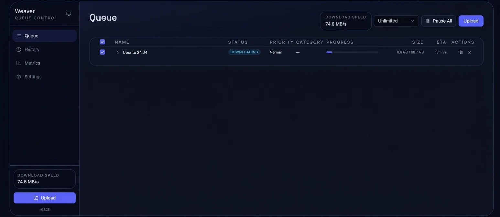

<p align="center">
  
</p>

<h1 align="center">Weaver</h1>

<p align="center">
  A modern, all-in-one Usenet downloader built in Rust.<br/>
  Download, repair, and extract — in a single binary.
</p>

<p align="center">
  <a href="https://github.com/scryer-media/weaver/releases"></a>
  <a href="https://ghcr.io/scryer-media/weaver"></a>
  <a target="_blank" href="https://www.scryer.media/weaver/donate/"></a>
</p>

---

<p align="center">
  <a target="_blank" href="https://www.scryer.media/weaver/"></a>
</p>

## What is Weaver?

Weaver is a Usenet binary downloader that handles the entire pipeline — downloading articles, decoding, PAR2 verification and repair, and extraction (RAR, 7z, etc) — all within a single self-contained binary. No need to install `unrar`, `par2repair`, or any other external tools.

Instead of the traditional sequential approach (download everything, then repair, then extract), Weaver can run downloading and extraction concurrently*. Extraction begins as soon as the first archive volume finishes downloading, so files appear on disk while the rest of the job is still in progress.

### Key Features

- **Single binary** — no external `unrar`, `par2`, or other tools required
- **Ultra fast** — weaver is native compiled machine code and can run faster than NZBGet for certain files, due to running all operations in one process 
- **Incremental extraction** — starts extracting files while still downloading
- **Real-time updates** — websocket push for job progress and system events, less chatty than other tools
- **Monthly download quotas** — configurable monthly data limits to work with ISP bandwidth caps
- **Observable** — Built in metrics and timeline views help visualize what happens during download with support for prometheus 

## Install

Installation instructions can be found on the [Weaver docs website](https://www.scryer.media/weaver/docs/installation/)

### Windows desktop

For Windows, use the x64 or ARM64 MSI from the GitHub release, or install that same MSI through WinGet:

```powershell
winget install --id ScryerMedia.Weaver --exact
```

The initial desktop releases are intentionally **unsigned**. Windows may show a browser download warning, then SmartScreen's **More info → Run anyway** prompt, and UAC's **Unknown publisher** prompt for the machine-wide installer. Those prompts are expected for these consumer-only releases; do not install an MSI from anywhere other than the Weaver GitHub release.

Every Windows ZIP and MSI has a SHA-256 entry in `SHA256SUMS` and a GitHub build-provenance attestation. To verify a downloaded MSI, compare `Get-FileHash .\weaver-windows-x86_64.msi -Algorithm SHA256` with the release checksum, then run `gh attestation verify .\weaver-windows-x86_64.msi --repo scryer-media/weaver`.

The MSI installs `weaver.exe` for CLI use and `weaver-tray.exe` for the desktop experience. The tray launches Weaver for the current user, opens a browser after an interactive start, and starts quietly at sign-in. Silent MSI and WinGet installs never start the tray or browser. The portable ZIP remains available for advanced use; launch `weaver-tray.exe` from it for the desktop experience.

If you previously installed the portable `0.7.4` package with WinGet, make this one-time transition explicitly; WinGet otherwise keeps the old installer type when upgrading:

```powershell
winget upgrade --id ScryerMedia.Weaver --exact --installer-type msi --uninstall-previous
```

This removes the old portable command link and files, then installs the MSI. It deliberately leaves legacy portable data and credentials untouched.

Encryption-at-rest setup is automatic: macOS uses Keychain, Linux uses a mode-`0600` key file, and the Windows desktop tray stores its key in Credential Manager under `ScryerMedia.Weaver.Desktop.v1` with state in `%LOCALAPPDATA%\ScryerMedia\Weaver`. It never reads or changes legacy portable state, which continues to use its existing Windows Credential Manager entry. Existing `WEAVER_ENCRYPTION_KEY` overrides take precedence.

## Docker

Weaver publishes a first-party container image:

- `ghcr.io/scryer-media/weaver:latest` with both Linux binaries bundled per architecture and a CPU-aware launcher that picks the best one at startup

Published GHCR images are keyless-signed with Sigstore Cosign.

The Docker contract is intentionally small:

- Persist app data in `/config`
- Use `PUID` / `PGID` when you want the container to re-own `/config` and then drop privileges
- `TZ` defaults to `Etc/UTC`
- `UMASK` has no image default and is optional; it accepts standard octal values such as `022`
- `--user=1000:1000` and `--read-only=true` are both supported

Completed downloads default to `/config/complete` and in-progress work to `/config/intermediate`.
If you only mount `/config`, finished media accumulates inside the config volume. Mount a
separate downloads volume and point Weaver at it with `WEAVER_COMPLETE_DIR` and
`WEAVER_INTERMEDIATE_DIR`. Both are first-run seeds: they apply only while the corresponding
setting is still empty, and are ignored once Weaver has started or the value has been changed
in the UI.

When neither `WEAVER_ENCRYPTION_KEY` nor the Docker secret at `/run/secrets/weaver_encryption_key` is provided, Weaver creates `/config/encryption.key` with mode `0600`. Preserve that file with the rest of `/config`; existing external keys take precedence and are not copied into the volume.

### docker-compose

```yaml
services:
  weaver:
    image: ghcr.io/scryer-media/weaver:latest
    container_name: weaver
    environment:
      - PUID=1000
      - PGID=1000
      - TZ=Etc/UTC
      - UMASK=022 # optional
      - WEAVER_HTTP_ALLOWED_HOSTS=weaver # permit the Compose service name
    volumes:
      - /path/to/weaver/config:/config
    ports:
      - 9090:9090
    restart: unless-stopped
```

Weaver always validates the HTTP `Host` authority. Direct access through `localhost` or an IPv4/IPv6 literal works without configuration. Set `WEAVER_HTTP_ALLOWED_HOSTS` to a comma-separated list of exact DNS, container, or reverse-proxy names used to reach Weaver. An entry without a port allows that hostname on any port; `host:port` restricts it to that port. Schemes, paths, credentials, and wildcards are rejected, and forwarded-host headers are not trusted.

Archive extraction is protected by always-on expansion limits. The defaults are 2 TiB per job, 1 TiB per member, 100,000 entries, a 100:1 expansion ratio, 12 hours, a free-space reserve of `max(512 MiB, min(5% of the filesystem, 20 GiB))`, and half of cgroup-aware memory clamped to 64 MiB–64 GiB. Override them with byte-count or integer environment values: `WEAVER_EXTRACTION_MAX_JOB_BYTES`, `WEAVER_EXTRACTION_MAX_MEMBER_BYTES`, `WEAVER_EXTRACTION_MAX_ENTRIES`, `WEAVER_EXTRACTION_MAX_RATIO`, `WEAVER_EXTRACTION_MAX_SECONDS`, `WEAVER_EXTRACTION_MIN_FREE_BYTES`, and `WEAVER_EXTRACTION_MAX_MEMORY_BYTES`. Invalid or zero values prevent startup.

If you run the container as root, the entrypoint will re-own `/config` to `PUID` / `PGID` and then drop privileges before starting `weaver`. If you run with `--user=1000:1000`, make sure the bind mount is already owned by that uid/gid because the ownership repair path is skipped in non-root mode.

For hardened deployments, `weaver` supports `--read-only=true` as long as `/config` remains writable.


## RAR direct-store (opt-in, off by default)

A store-only RAR release normally costs about twice its size on disk: first the `.rar` volumes, then the extracted files. With direct-store enabled, Weaver writes the payload of `Store` members straight to its final destination as the articles arrive, so the volumes never exist as files and the release lands once. This includes password-protected sets: RAR4/RAR5 file encryption (`-p`) decrypts on the way in given the job's password, and RAR5 header encryption (`-hp`) routes when the password is available at admission — from the job itself, the NZB's password metadata, or the `{{password}}` filename convention — and its stored check verifies it. A set whose password cannot be proven falls back to the ordinary path with a password prompt, exactly as before.

It is **off by default** while it matures. Turn it on with the `direct_store` settings:

| Setting | Environment override | Default | Meaning |
| --- | --- | --- | --- |
| `direct_store.enabled` | `WEAVER_RAR_DIRECT_STORE` | `false` | Route eligible RAR `Store` sets straight to their destinations. |
| `direct_store.holds_scratch_ceiling_bytes` | `WEAVER_RAR_DIRECT_STORE_SCRATCH_CEILING_BYTES` | 536870912 (512 MiB) | Per-archive-set ceiling on the scratch file that holds decoded bytes whose destination is not resolved yet. Breaching it makes that one set fall back to the ordinary path. |

**Precedence is environment over settings over default.** The environment variable is an operator override for incident response, so it wins in both directions: `WEAVER_RAR_DIRECT_STORE=0` forces direct-store off even when the setting says on, and `=1` forces it on. Values it does not recognise are ignored rather than treated as "off", so a typo cannot silently disable a feature you configured. Both are read once at startup; changing them takes effect on the next restart.

**Turning it off is a kill switch, not just a refusal.** With direct-store disabled at startup, a job that was mid-flight under an enabled build does not resume as a direct job: its partially written destinations and internal envelope files are swept out of the working directory and the job redownloads conventionally. Nothing half-written is left where finished work belongs. The stored coverage records are kept rather than deleted, so re-enabling the feature later is a supported round trip — a re-enabled build re-validates them and redownloads anything it cannot prove.

**Expect an instant, or absent-looking, `Extracting` phase.** For a direct-store job the payload is already at its destination when the download finishes, so there is nothing left to extract: the extraction phase completes immediately and may not be visible at all in the UI or the API. This is the feature working, not a stalled or skipped step, and progress reporting is otherwise unchanged — Weaver does not insert an artificial delay to make the phase visible, and the GraphQL surface is identical either way. A job that starts direct and later falls back reports both, so a release that ended up on the ordinary path still shows a normal extraction phase.

Sets Weaver cannot route this way — compressed, solid, header-encrypted RAR4, header-encrypted RAR5 whose password it cannot prove, or checksummed in a way it cannot verify out of order — simply take the ordinary download-then-extract path, with no change in output.

## API

Weaver exposes a **GraphQL API** at `/graphql` with full query, mutation, and subscription support. The same API powers the web UI, so anything you can do in the interface is available programmatically.


## License

GPL-3.0-or-later with the UnRAR source-code restriction for RAR extraction. See [LICENSE](LICENSE) for details.
